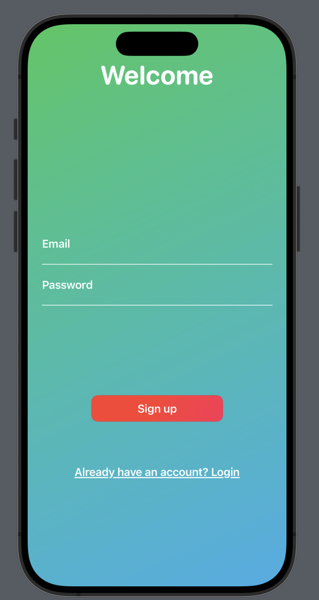
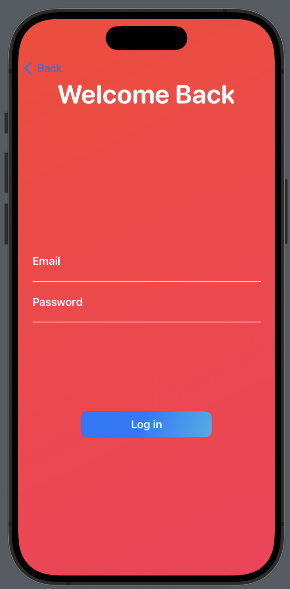
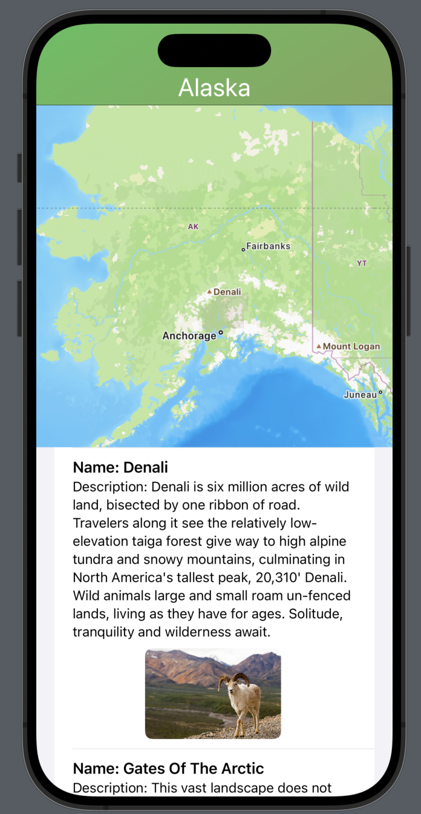
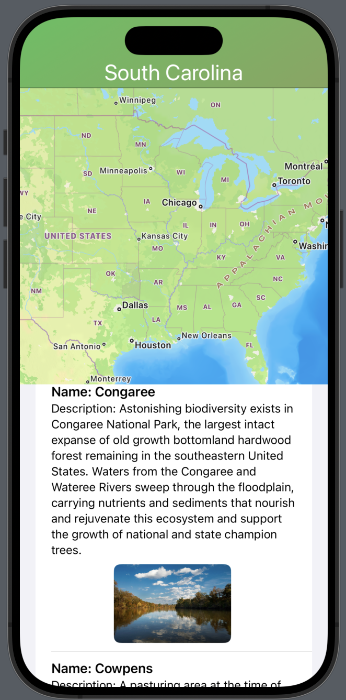
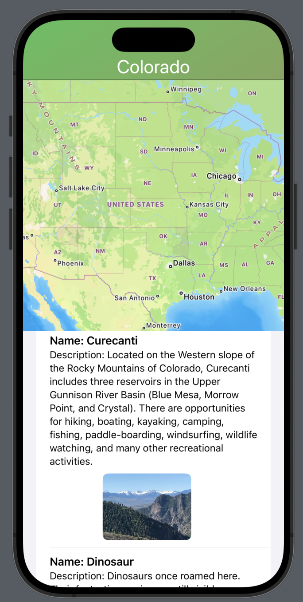

# nps-app
**Project Description**
This is an iOS developed in Swift through XCode that allows users to look at all NPS (National Park Services) parks in a selected state. Upon entering the app, the user will be greeted with a welcome page where they will be prompted to either sign up or login. All sign ups and logins are verified through Firebase authentication, allowing users to create an account and then login to that existing account with their email and password. Email and password formats are validated by Firebase, and anyone attempting to sign in with an account that already exists will be prompted to login. This logic is housed in the ContentView class. If the user chooses to log in instead, they will be taken to a different page via the LoginScreen class where they can log in to their existing account. Upon getting through the sign up / log in stage, users will be taken to a page created with the MapView class where a clickable map of the United States is rendered with the MapKit library. When a user clicks on a location on the map, the state that they selected is determined through reverse geocoding. Following this, a call is made to the NPS API which retrieves the names, descriptions, and images of all of the NPS parks in that specific state. This information is then displayed to the user as a scrollable region. See the images below to see the app's appearance.

**Welcome / Sign Up Screen**

**Login Screen**

**Sample Outputs**

